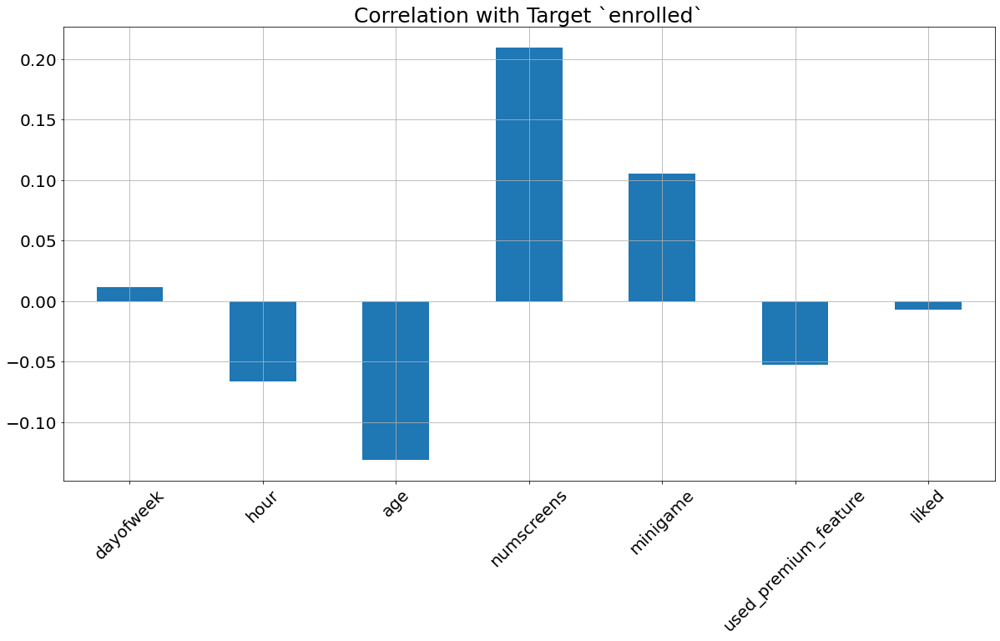
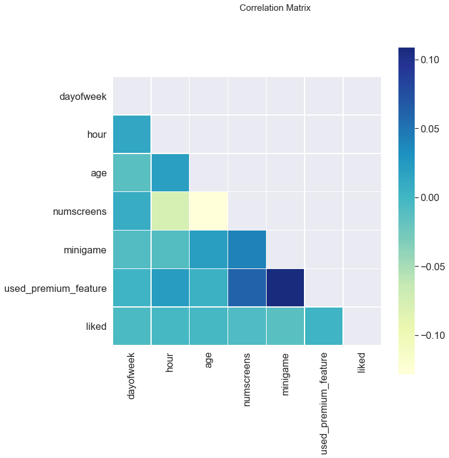
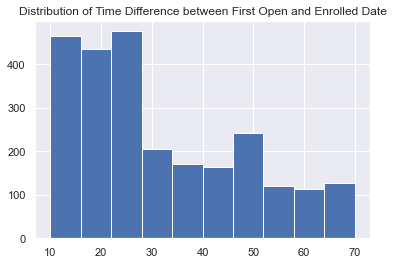

# Directing Customers Through App Behavior Analysis

## Introduction

* In today's market, a lot of companies provide free services in their mobile applications in order, usually for a limited time, in order to attract customers/clients to subscribe in their permium service which includes all features for unlimited time.

* In order to attract the most possible number of these customers, they need to focus on targeting the customers who used the mobile application but didn't subscribe yet for the permium services in order to give them discounts and offers that may not that influential if offered to those who already have the intention to subscribe in all cases.

* We are going to build a model that predicts which users won't subscribe to the paid membership so that the greater marketing efforts can go into trying to convert them to paid users.

## Data

* The [dataset](https://sds-platform-private.s3-us-east-2.amazonaws.com/uploads/P39-CS3-Data.zip) used is a fintech company that wants to provide its customers with a paid mobile app subscription that will allow them to track all of their finances in one place.

* To attract customers, the company releases a free version of their app with some of the main features unlocked. The company wants to identify which users will not likely to enroll in the paid product, so that additional offers can be given to them and not to everybody specially that there will be customers who are going to enroll anyway.

* The dataset contains 50 thousand records (row) each has 12 columns including our target the enrollement status as following:

|        Column        |                                     Description                                     |
|:--------------------:|:-----------------------------------------------------------------------------------:|
|         user         |                                       User ID                                       |
|      first_open      |              The time where the user opened the app for the first time              |
|       dayofweek      |         The index of the day on which the app was opened for the first time         |
|         hour         |               The hour at which the app was opened for the first time               |
|          age         |                                 The age of the user                                 |
|      screen_list     | A comma-separated string of all screens the user showed during the usage of the app |
|      numscreens      |               The number of screens showed during the usage of the app              |
|       minigame       |                   If the user played the mini game (1) or not (0)                   |
|         liked        |                If the user liked the app on the store (1) or not (0)                |
| used_premium_feature |                  If the user used a premium feature (1) or not (0)                  |
|       enrolled       |         If the user actually enrolled in the paid membership (1) or not (0)         |
|     enrolled_date    |              The data on which the user enrolled in the paid membership             |

## Histograms

1. `dayofweek`: shows a nearly-even distribuition along all days.
2. `hour`: a huge drop after 2:00 AM until 10:00 AM which is very logic considering the users are probably asleep.
3. `age`: shows that most of users are in the range of 20-40 with sharp peaks at 30 and 40.
4. `numscreens`: a left-tailed distribution with the majority being at 20-30 screen per user.
5. `minigame`: shows that a high skew in the favour of not playing the mini game.
6. `used_premium_feature`: shows that a high skew in the favour of not using the premium features.
7. `liked`: shows that a high skew in the favour of not liking the app on the store.

## Correlation with Target

1. `dayofweek`: as we saw in the histogram, the distribuition was quite even which caused the corrleation between it and the target to be very small.
2. `hour`: the negative correlation means that at earlier hours the possibilty of getting enrolled is higher.
3. `age`: the younger the user the higher possibility to get enrolled.
4. `numscreens`: the more screens the user interact with the higher enrollement probability.
5. `minigame`: the state of playing the mini game increase the possibility of enrollement.
6. `used_premium_feature`: **Surprisingly**, using the premium feature decreases the possibility of enrollement.
7. `liked`:  **Surprisingly**, liking the app decreases the enrollement rate, yet, it's a very small correlation.

## Correaltion Matrix

1. No 2 features have a correlation between each other higher than 0.1 in either direction. 
2. The strongest realtionship is between `minigame` and `used_premium_feature`.
3. No need to eliminate any features as no strong linear correlations exist among them.

## Feature Engineering

### Response Time

* In order to make a model that is valid in the future. We need to a set a time limit after which we can look if that customer enrolled or not. We will take that threshold by taking a reasonable time that involves the majority of the customers who enrolled in the membership.

* To calculate the time taken for each customer to response, we will subtract the enrollement time from the first open time.

We will take the time threshold at 48 hours (2 days). After that, the customer will be considered unrolled as we will check the model's performance after 2 days of operating it.

## Screens

* We want to divide the `screen_list` into separated columns each correspond to a specific type of the screens (saving, loans, credit, other)

* We have a separate .csv file ('top_screens.csv') that contains the top and most-viewed screens.

## Results

Using `LogisticRegression` class from, we achieved 77% accuracy.